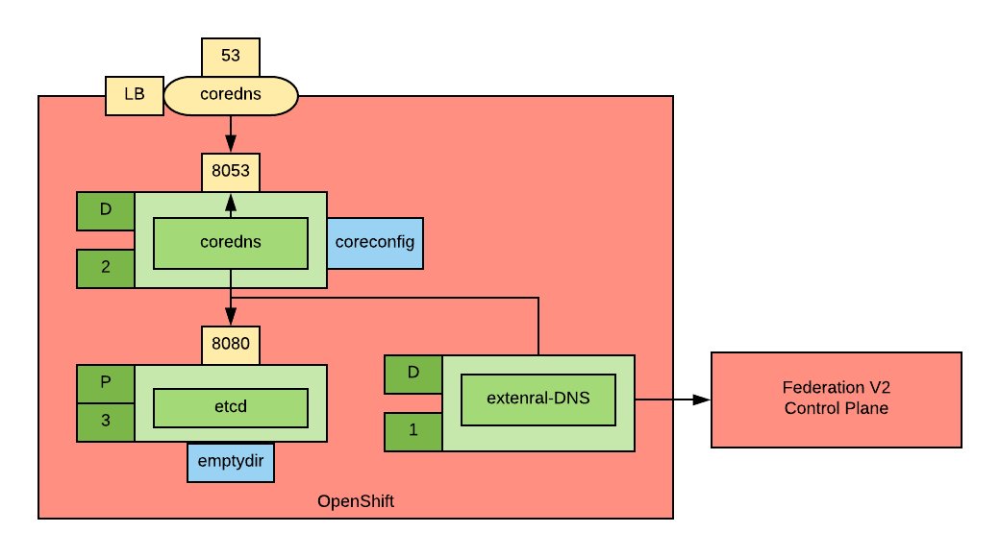
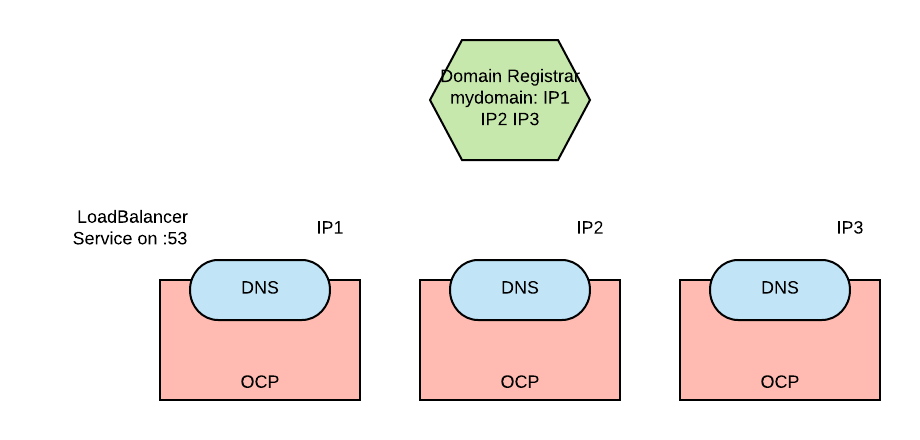

# Install a self-hosted global load balancer

These are the instrctions to install a self-hosted global load balancer based on external-DNS and coredns.
We assume you have already installed federation. You can do it following these [instructions](https://github.com/raffaelespazzoli/openshift-federation).

To install the slef-hosted global load balancer you need an [inventory](./ansible/inventory) file as follows:

```yaml
clusters:
- name: <cluster_1_name>
  url: <cluster_1_master_api_url>
  username: <cluster_1_username>
  password: <cluster_1_password>
  federation_control_plane: true  
- name: <cluster_2_name>
  url: <cluster2_master_api_url>
  username: <cluster_2_username>
  password: <cluster_2_password>
  federation_control_plane: false
```

Once you inventory is ready, you can run the playbook as follows:

```shell
ansible-playbook -i <inventory> ./ansible/playbooks/deploy-sh-glb/deploy-sh-glb.yaml
```

This will deploy a dns server in each of you cluster. The DNS server is implemnetd by coredns using etcd as the storage.
external-DNS is the also deployed to feed coredns pointing to the cluster with the federation control plane:



Once the deployemnt complete, coredns will explose a load balancer type sservice for each cluster in the inventory.
You should get the IPs of these services and configure the registrar of your domain to send requests to those IPs.



## Making sure LoadBalancer services work

You will need LoadBalancer type services to install the selh-hosted global load balancer and run the example.
If you environment does not support LoadBalancer type services (like mine), you can install [MetalLB](https://metallb.universe.tf/installation/).

```shell
oc new-project metallb
oc adm policy add-scc-to-user anyuid -z metallb-controller -n metallb
oc adm policy add-scc-to-user privileged -z metallb-speaker -n metallb
helm template --name metallb --namespace metallb metallb/charts/metallb | oc apply -f - -n metallb
```

You have to run the above commands in each of your clusters.
Check out a configuration example [here](./metallb). you can configure metallb with this:

```shell
oc apply -f metallb/env1.yaml -n metallb
```

You have to run the above command in each of your clusters.

## Test

In the cluster with the federation controle plane create a federated service and corresponfing federated service record

```shell
oc new-project test-shglb
oc apply -f test/federated-service.yaml -n test-shglb
oc apply -f test/dnsrecord.yaml -n test-shglb
```

at this point a dnsendpoint object should be created, you can inspect it with:

```shell
oc get dnsendpoint service-test-shglb -n test-shglb -o yaml
```

now you should be able to the following:

```shell
dig @<IP of one of the exposed coredns> test-shglb.<domain>
```

and see a result.